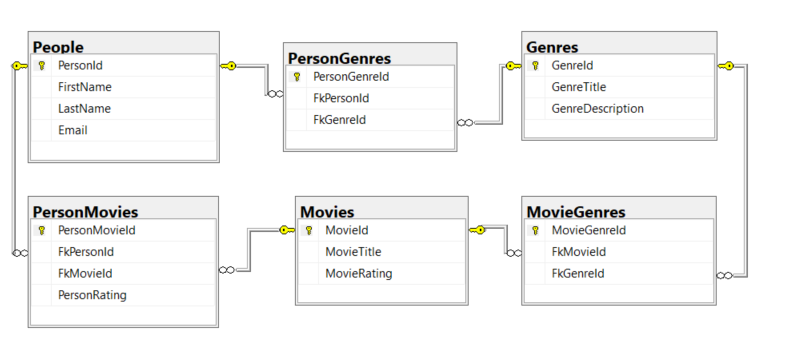

<h1 align="center">🎬 Movie System API 🎬</h1>

by <a href="https://github.com/Cecilia-Coutinho">Cecilia Coutinho</a>

<h2>🌍 Overview</h2>

The development of this project was required by Chas Academy, and as such, it followed the specified requirements and deadline. The primary objective of the project was to build a REST API that enables users to manage data related to movies, genres, people, and ratings. To achieve this, it was utilized ASP.NET Core and Entity Framework to develop an API that provides various endpoints for retrieving and adding data.

<h2>📋 MVP</h2>

The Minimum Viable Product(MVP) of the Movie System API includes the following features:

>📋 Get all people in the system

>🎭 Get all genres linked to a specific person

>🎬 Get all movies linked to a specific person

>⭐ Add and retrieve ratings for movies linked to a person

>🔗 Link a person to a new genre

>➕ Add new movies for a specific person and a specific genre

>🔍 Get suggestions for movies in a certain genre from an external API, e.g. TMDB.

 
<h2>💻 Technology Stack</h2>

>👨‍💻 <b>C#</b>: primary language.

>🚀 <b>ASP.NET</b>: Framework.

>🗄️ <b>Entity Framework</b>: Object-relational mapper.

>🔗 <b>RESTful API architecture</b>: Architectural style.

>👥 <b>GitHub</b>: version control.

>🖥️ <b>Visual Studio</b>: IDE.

>🦜 <b>Swagger</b>: API structure reader.

>🛌 <b>Insomnia</b>: API test case management tool.

 
<h2>💭Reflections and Aditional Info</h2>

In this section, you can find my reflections on working with SQL and Rest-API, along with some additional information and insights gained throughout the project.

 
<h3>🔍SQL</h3>

The data schema for this project was designed to store and retrieve data related to people, genres, movies, and their relationships.

I chose to represent Movie as an entity rather than just an attribute in the "PersonGenres" table because a movie can belong to multiple genres, and multiple people can be interested in the same movie. Keeping movies as a separate entity allows for better data organization and avoids duplication.

If movies were only represented as a column in the "PersonGenres" table, it would result in redundant data and potentially make querying and updating the data more difficult. Updating a movie's information would require updating every row where that movie is listed, which could be time-consuming and error-prone, leading to bad design.

Denormalization can be used to improve database performance by reducing the number of joins required for queries. However, it can also result in redundant data and potential inconsistency, leading to data anomalies. Therefore, careful consideration of the trade-offs between performance and data integrity is required when using denormalization and due to time constraints, I did not see any immediate benefit in modifying my initial data schema using denormalization for this project, despite being aware that it could simplify the queries to facilitate data's retrieving.

**DataSchema:**

 
<h3>👨‍💻Code</h3>

The project was designed to allow Entity Framework to interact with the database and expose a REST API using ASP.NET Core. It has endpoints implemented to retrieve data related to people, genres, and movies, as well as endpoints to add and retrieve ratings for movies, to link a person to a new genre, add new movies for a specific person and a specific genre and link people to genres.

After built the code, I realized that there are some things that could be improved:

- Minimal API: It’s a new approach in ASP.NET Core, which provides a simpler way to define and expose APIs without the need for redundant code. Although I didn't use it in this project, I recognize that it could be beneficial in future projects.

- DTOs: I learned that using Data Transfer Objects (DTOs) to decouple the API layer from the database layer can provide a consistent view of the data and prevent issues with the exposition of data or mapping. Looking back, I can see how using DTOs could improve the code and make it more maintainable.

- Repository Pattern: Separating the data access logic from the rest of the application using the repository pattern could make the code more maintainable and testable. While I didn't implement this pattern in this project due to time constraints, I can see how it could benefit larger projects.

With these improvements, I believe the code could be more maintainable, testable, and scalable. And also make it easier to add new features in the future. However, I know these improvements require additional time and effort and, for this specfic delivery,  I found it more important to focus only on delivering functional features that fulfill the project's requirements and constraints.

In summary,I acknowledge that I could have done a better job with these aspects of the project, and I recognize that there is always room for improvement. In the future, I plan to continue learning and implementing best practices to improve the quality and maintainability of my code.

**Code Structure**

The code is structured as follows:

* **/Controllers** - Contains all the controllers used for creating the required endpoints.
* **/Data** - Contains the Database Context and related entities.
* **/Migrations** - Contains all the migrations to the SQL database.
* **/Models** - Contains the data model for the database tables and controllers.
* **/Services** - Contains auxiliary code necessary for the controllers to function properly.

 
<h3>🧪 API EndPoints Test Cases</h3>

 
📋 <b>GET</b> all people in the system:

- *Url path:* ` /person `

- *Status Code:* ` 200 OK `

- *Response Body:* 
<pre><code>
[
	{
		"personId": 4,
		"firstName": "Kalle",
		"lastName": "Tester",
		"email": "kalle.tester@example.com"
	},
	{
		"personId": 6,
		"firstName": "Krille",
		"lastName": "Tester",
		"email": "krille.tester@example.com"
	}
]
</code></pre>

 
🎭 <b>GET</b> all genres linked to a specific person:

- *Url path:* ` /persongenre/person?personId=<<personId>> `

- *Status Code:* ` 200 OK `

- *Response Body:* 
<pre><code>
[
	"Action",
	"Adventure",
	"Animation",
	"Comedy",
	"Crime",
	"Documentary",
	"Drama",
	"Family"
]
</code></pre>

 
🎬 <b>GET</b> all movies linked to a specific person:

- *Url path:* ` /personmovie/movies/person?personId=<<personId>> `

- *Status Code:* ` 200 OK `

- *Response Body:* 
<pre><code>
[
	"The Godfather",
	"The Shawshank Redemption",
	"The Godfather Part II",
	"12 Angry Men",
	"Spider-Man: Into the Spider-Verse",
	"Puss in Boots: The Last Wish",
	"The Lion King",
	"Coco"
]
</code></pre>

 
⭐ <b>POST</b> ratings for movies linked to a person:

- *Url path:* ` /personmovie/movierating?personId=<<personId>>&movieId=<<movieId>> `

- *JSON Input:* ` 3.5 `

- *Status Code:* ` 200 OK `

- *Response Body:* 
<pre><code>
{
	"personMovieId": 21,
	"fkPersonId": 1,
	"fkMovieId": 15,
	"personRating": 3.5
}
</code></pre>

 
⭐ <b>GET</b> ratings for movies linked to a person:

- *Url path:* ` /personmovie/movie/rating/person?personId=<<personId>> `

- *Status Code:* ` 200 OK `

- *Response Body:* 
<pre><code>

[
	{
		"personMovieId": 21,
		"fkPersonId": 1,
		"fkMovieId": 15,
		"personRating": 3.50
	},
	{
		"personMovieId": 22,
		"fkPersonId": 1,
		"fkMovieId": 30,
		"personRating": 0.00
	}
]
</code></pre>

 
🔗 <b>POST</b> a person to a new genre:

- *Url path:* ` /persongenre/person?personId=<<personId>> `

- *JSON Input:* ` 2 `

- *Status Code:* ` 200 OK `

- *Response Body:* 

<pre><code>
{
	"personGenreId": 12,
	"fkPersonId": 6,
	"fkGenreId": 2
}
</code></pre>

 
➕ <b>POST</b> new movies for a specific person and a specific genre:

- *Url path:* ` /personmovie/movies?personId=<<personId>>&genreId=<<genreId>> `

- *Status Code:* ` 200 OK `

- *Response Body:* 

<pre><code>
[
	{
		"movieId": 4,
		"title": "Schindler's List",
		"rating": 8.60
	},
	{
		"movieId": 5,
		"title": "12 Angry Men",
		"rating": 8.50
	},
	{
		"movieId": 12,
		"title": "Psycho",
		"rating": 8.40
	},
	{
		"movieId": 14,
		"title": "One Flew Over the Cuckoo's Nest",
		"rating": 8.40
	},
	{
		"movieId": 59,
		"title": "Django Unchained",
		"rating": 8.20
	}
]
</code></pre>

 
🔍 <b>GET</b> suggestions for movies in a certain genre from an external API, e.g. TMDB.:

- *Url path:* ` /movies/recommendation?genre=<<genreName>> `

- *Status Code:* ` 200 OK `

- *Response Body for genre=action:* 
<pre><code>
[
	{
		"title": "Shazam! Fury of the Gods",
		"rating": 6.9
	},
	{
		"title": "Ant-Man and the Wasp: Quantumania",
		"rating": 6.5
	},
	{
		"title": "Avatar: The Way of Water",
		"rating": 7.7
	},
	{
		"title": "Creed III",
		"rating": 7.3
	},
	{
		"title": "Murder Mystery 2",
		"rating": 6.6
	},
	{
		"title": "Pirates Down the Street II: The Ninjas from Across",
		"rating": 8
	},
	{
		"title": "65",
		"rating": 6.3
	},
	{
		"title": "John Wick: Chapter 4",
		"rating": 8
	},
	{
		"title": "Kill Boksoon",
		"rating": 6.7
	},
	{
		"title": "Supercell",
		"rating": 6.3
	},
	{
		"title": "Attack on Titan",
		"rating": 6.2
	},
	{
		"title": "The Last Kingdom: Seven Kings Must Die",
		"rating": 7.5
	},
	{
		"title": "The Park",
		"rating": 5.8
	},
	{
		"title": "Black Panther: Wakanda Forever",
		"rating": 7.3
	},
	{
		"title": "Black Adam",
		"rating": 7.1
	},
	{
		"title": "Plane",
		"rating": 6.9
	},
	{
		"title": "Gold Run",
		"rating": 6.6
	},
	{
		"title": "Queens on the Run",
		"rating": 7.2
	},
	{
		"title": "Shotgun Wedding",
		"rating": 6.3
	},
	{
		"title": "Fast X",
		"rating": 0
	}
]
</code></pre>